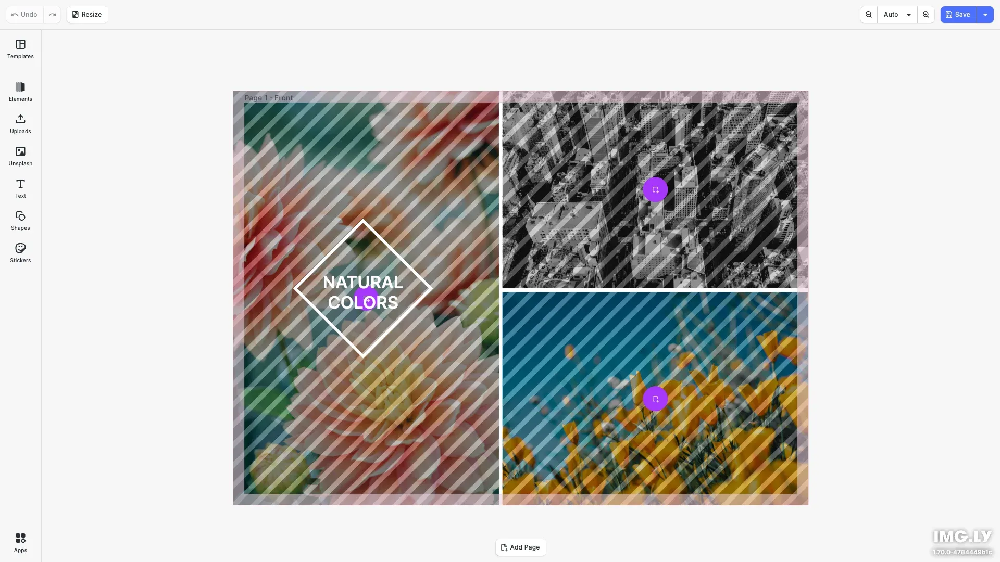

# Unsplash Editor Starter Kit

Create stunning graphics and layouts with free high-quality images from Unsplash. Built with [CE.SDK](https://img.ly/creative-sdk) by [IMG.LY](https://img.ly), this starter kit integrates Unsplash's extensive photo library directly into the design editor.

<p>
  <a href="https://img.ly/docs/cesdk/starterkits/unsplash-editor/">Documentation</a> |
  <a href="https://img.ly/showcases/cesdk">Live Demo</a>
</p>



## Getting Started

### Clone the Repository

```bash
git clone https://github.com/imgly/starterkit-unsplash-asset-source-ts-web.git
cd starterkit-unsplash-asset-source-ts-web
```

### Install Dependencies

```bash
npm install
```

### Download Assets

CE.SDK requires engine assets (fonts, icons, UI elements) served from your `public/` directory.

```bash
curl -O https://cdn.img.ly/packages/imgly/cesdk-js/$UBQ_VERSION$/imgly-assets.zip
unzip imgly-assets.zip -d public/
rm imgly-assets.zip
```

### Configure Unsplash API (Optional)

For production use, set up your own Unsplash API proxy:

1. Create an Unsplash developer account: https://unsplash.com/developers
2. Set up a proxy server to add your API key server-side
3. Set the `VITE_UNSPLASH_API_URL` environment variable

```bash
# .env
VITE_UNSPLASH_API_URL=https://your-proxy.example.com
```

The starter kit includes a demo proxy URL for development purposes.

### Run the Development Server

```bash
npm run dev
```

Open `http://localhost:5173` in your browser.

## Features

### Unsplash Integration

- **Search Images** - Search Unsplash's library of millions of free photos
- **Browse Popular** - View trending and popular images when no search query
- **Attribution** - Automatic photographer credits per Unsplash guidelines
- **High Quality** - Access full-resolution images for export

### Design Capabilities

- **Text Editing** - Typography with fonts, styles, and effects
- **Shapes & Graphics** - Vector shapes and design elements
- **Templates** - Start from pre-built design templates
- **Multi-Page** - Create multi-page documents
- **Export** - PNG, JPEG, PDF with quality controls

## Configuration

### Customizing the Unsplash Asset Source

```typescript
import { setupUnsplashAssetSource } from './imgly/plugins/unsplash';

// The asset source is automatically configured in initUnsplashEditor()
// To customize, modify src/imgly/plugins/unsplash.ts
```

### Theming

```typescript
cesdk.ui.setTheme('dark'); // 'light' | 'dark' | 'system'
```

See [Theming](https://img.ly/docs/cesdk/web/ui-styling/theming/) for custom color schemes and styling.

### Localization

```typescript
cesdk.i18n.setTranslations({
  de: { 'libraries.unsplash.label': 'Unsplash Fotos' }
});
cesdk.i18n.setLocale('de');
```

See [Localization](https://img.ly/docs/cesdk/web/ui-styling/localization/) for supported languages and translation keys.

## Architecture

```
src/
├── imgly/
│   ├── config/
│   │   ├── actions.ts                # Export/import actions
│   │   ├── features.ts               # Feature toggles
│   │   ├── i18n.ts                   # Translations
│   │   ├── plugin.ts                 # Main configuration plugin
│   │   ├── settings.ts               # Engine settings
│   │   └── ui/
│   │       ├── canvas.ts                 # Canvas configuration
│   │       ├── components.ts             # Custom component registration
│   │       ├── dock.ts                   # Dock layout configuration
│   │       ├── index.ts                  # Combines UI customization exports
│   │       ├── inspectorBar.ts           # Inspector bar layout
│   │       ├── navigationBar.ts          # Navigation bar layout
│   │       └── panel.ts                  # Panel configuration
│   ├── index.ts                  # Editor initialization function
│   └── plugins/
│       └── unsplash.ts
└── index.ts
```

## Unsplash API Guidelines

When using Unsplash images, follow their [API guidelines](https://unsplash.com/documentation#guidelines--crediting):

- Always include photographer attribution
- Link back to the photographer's Unsplash profile
- Include UTM parameters for referral tracking

The starter kit handles all attribution requirements automatically.

## Prerequisites

- **Node.js v20+** with npm - [Download](https://nodejs.org/)
- **Supported browsers** - Chrome 114+, Edge 114+, Firefox 115+, Safari 15.6+

## Troubleshooting

| Issue | Solution |
|-------|----------|
| Editor doesn't load | Verify assets are accessible at `baseURL` |
| Unsplash images don't load | Check `VITE_UNSPLASH_API_URL` configuration |
| No search results | Verify proxy server is running and accessible |
| Watermark appears | Add your CE.SDK license key |

## Documentation

For complete integration guides and API reference, visit the [Unsplash Editor Documentation](https://img.ly/docs/cesdk/starterkits/unsplash-editor/).

## License

This project is licensed under the MIT License - see the [LICENSE](LICENSE) file for details.

Unsplash photos are provided under the [Unsplash License](https://unsplash.com/license).

---

<p align="center">Built with <a href="https://img.ly/creative-sdk?utm_source=github&utm_medium=project&utm_campaign=starterkit-unsplash-editor">CE.SDK</a> by <a href="https://img.ly?utm_source=github&utm_medium=project&utm_campaign=starterkit-unsplash-editor">IMG.LY</a></p>
